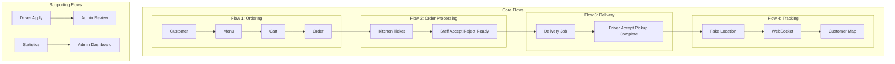
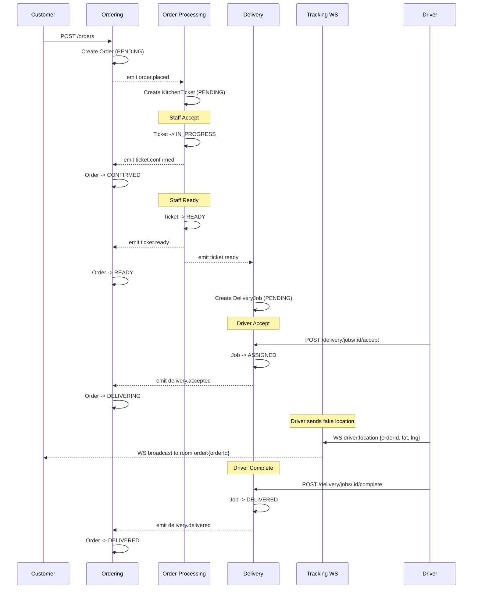

# Real-time Food Delivery

Food Delivery demo project cho 4 nhóm actor:

- Customer: xem menu, thêm vào cart, đặt hàng, xem lịch sử và chi tiết đơn
- Staff: xử lý kitchen ticket theo trạng thái
- Driver: nhận job giao hàng và cập nhật trạng thái giao hàng
- Admin: duyệt driver, xem dashboard và quản lý menu theo milestone plan

## Project Scope

> Demo cho giảng viên, 4-7 concurrent users, happy path focused, không production.
> Team 4 thành viên, timeline 11 tuần.
> Architecture baseline: Layered Architecture + Client-Server.

## Tech Stack

- Backend: NestJS + MongoDB + Mongoose
- Frontend: Next.js 16 App Router + React 19 + TypeScript
- Realtime: WebSocket (Nest Gateway + Socket.IO)
- Internal workflow propagation: EventEmitter2 + `@OnEvent()`
- Maps: OpenStreetMap + Leaflet.js

---

# Architecture Overview

## 1. Primary Architecture

Hệ thống được mô tả tốt nhất là:

- Layered Architecture + Client-Server ở mức toàn hệ thống
- Modular Monolith ở mức tổ chức backend
- In-process Event-Driven ở mức giao tiếp giữa các module backend

Nói ngắn gọn:

- Frontend đóng vai trò client cho 4 actor: Customer, Staff, Driver, Admin
- Backend NestJS là server tập trung, giữ source of truth cho auth, ordering, order processing, delivery, và realtime tracking
- Business flow đi theo hướng: Client -> Controller/Boundary -> Service/Application Logic -> Repository/Data + Integration/Gateway

## 2. Current Backend Design

Backend hiện tại không còn là cấu trúc flat `Controller -> Service -> Schema`. Project đang dùng cấu trúc layer nhẹ để bám sát design phase:

```text
backend/src/
├── common/
│   ├── configs/              # ConfigModule, env validation
│   ├── database/             # Mongo connection and shared schema base
│   ├── decorators/           # @Public, @Roles, @CurrentUser
│   └── guards/               # JwtAuthGuard, RolesGuard
├── integrations/
│   ├── map/
│   │   ├── adapters/
│   │   ├── interfaces/
│   │   └── map.module.ts
│   └── payment/
│       ├── adapters/
│       ├── interfaces/
│       └── payment.module.ts
├── modules/
│   ├── auth/
│   ├── delivery/
│   ├── events/
│   ├── order-processing/
│   └── ordering/
├── shared/
│   ├── constants/
│   └── enums/
├── app.module.ts
├── main.ts
└── seed.ts
```

Trong mỗi domain module, code thường được chia tiếp thành:

```text
modules/{module-name}/
├── {module}.module.ts
├── {module}.controller.ts // lớp nhận request từ client. Thuộc <<boundary>> layer (điểm vào của API)
├── {module}.service.ts  // nơi chứa application logic và các handler dùng OnEvent
├── repositories/
├── state/    // nơi giữ rule chuyển state cho Order, Ticket, Delivery, Driver
├── dto/  // request/response DTOs
├── schemas/
└── {entity}.schema.ts    //chứa các schema chính của module
```

Điểm quan trọng:

- Controllers và WebSocket Gateway đóng vai trò boundary
- Services giữ application logic và `@OnEvent()` handlers
- Repositories bọc truy cập Mongoose
- `state/` guards kiểm tra transition hợp lệ cho Order, Ticket, Delivery, Driver
- `integrations/` hiện thực Adapter pattern cho payment và map

## 3. Design Mapping

| Design View | Current Implementation |
|-------------|------------------------|
| `<<boundary>>` | NestJS Controllers + WebSocket Gateway |
| `<<application logic>>` | NestJS Services |
| `<<entity>>` | Mongoose schemas / domain data objects |
| External Gateway | `integrations/payment`, `integrations/map` |
| Data Access | `repositories/` per module |
| State-dependent control | `state/` guards + transition maps |

## 4. Event-Driven Communication

Event-driven ở đây là giao tiếp nội bộ giữa các module trong cùng một backend process, không phải distributed event bus hay microservices.

```typescript
this.eventEmitter.emit('order.placed', { orderId, items, customerId });

@OnEvent('order.placed')
handleOrderPlaced(payload: { orderId: string; items: any[] }) {
  // Create KitchenTicket
}
```

Cross-module events đang dùng trong flow hiện tại:

1. `order.placed` -> Order-Processing tạo ticket
2. `ticket.confirmed` -> Ordering cập nhật order sang `CONFIRMED`
3. `ticket.rejected` -> Ordering cập nhật order sang `CANCELLED`
4. `ticket.ready` -> Ordering cập nhật order sang `READY`, đồng thời Delivery tạo job
5. `delivery.accepted` -> Ordering cập nhật order sang `DELIVERING`
6. `delivery.delivered` -> Ordering cập nhật order sang `DELIVERED`

---

# Flows Overview

## Core Flows

| Flow | Tên | Mô tả | Backend | Frontend |
|------|-----|-------|---------|----------|
| Flow 1 | Ordering | Customer đặt hàng -> Menu, Cart, Order | Ordering | Customer UI |
| Flow 2 | Order Processing | Staff xử lý đơn -> Queue, Accept/Reject/Ready | Order-Processing | Staff UI |
| Flow 3 | Delivery | Driver nhận đơn -> Accept, Pickup, Complete | Delivery | Driver UI |
| Flow 4 | Tracking | Driver gửi vị trí, Customer xem map | Events Gateway + Ordering/Delivery context | Tracking UI |

## Supporting Flows

| Flow | Tên | Mô tả | Backend | Frontend |
|------|-----|-------|---------|----------|
| Flow 5 | Driver Recruitment | Driver apply -> Admin approve/reject | Delivery + Auth | Driver/Admin UI |
| Flow 6 | Admin Dashboard | Statistics + Menu Management | Planned in backend, partial in frontend | Admin UI |



---

# Current Repository Structure

## Root

```text
food-delivery/
├── .github/
├── backend/
├── docs/
├── frontend/
├── plans/
├── package.json
└── README.md
```

## Backend Modules

- `modules/auth/`: login, register, me, JWT, user repository
- `modules/ordering/`: menu endpoints, order creation, order history/detail, order event reactions
- `modules/order-processing/`: kitchen ticket endpoints, ticket lifecycle, `order.placed` subscriber
- `modules/delivery/`: delivery jobs, driver recruitment endpoints, delivery lifecycle, `ticket.ready` subscriber
- `modules/events/`: WebSocket gateway cho realtime tracking
- `integrations/payment/`: payment gateway abstraction + mock adapter
- `integrations/map/`: map gateway abstraction + mock adapter

## Frontend Structure

```text
frontend/src/
├── app/
│   ├── (admin)/
│   ├── (customer)/
│   ├── (driver)/
│   ├── (staff)/
│   ├── login/
│   ├── register/
│   ├── layout.tsx
│   └── providers.tsx
├── components/
│   ├── layout/
│   ├── shared/
│   └── ui/
├── features/
│   ├── admin/
│   ├── auth/
│   ├── cart/
│   ├── driver/
│   ├── menu/
│   ├── orders/
│   ├── staff/
│   └── tracking/
├── lib/
└── types/
```

Frontend vẫn theo feature-based pattern:

- `features/` chứa domain logic, hooks, services, domain UI
- `components/` chứa shared UI và layout
- `lib/api.ts` là Axios wrapper với JWT interceptor
- App Router groups đang tồn tại cho 4 actor, nhưng route-group-specific `layout.tsx` vẫn chưa hoàn tất đủ theo milestone plan

---

# Current Implementation Status

README cũ mô tả một số phần như thể đã hoàn thành toàn bộ. Thực tế hiện tại gần đúng hơn là:

## Implemented

- Auth backend hoàn chỉnh: register, login, me, global guards, JWT
- Seed script tạo test users và menu items
- Ordering flow backend và frontend cơ bản hoàn chỉnh
- Order Processing backend hoàn chỉnh; Staff queue UI đã có
- Delivery backend hoàn chỉnh; Driver jobs UI đã có
- WebSocket gateway backend cho tracking đã có
- Driver recruitment backend đã có
- Admin drivers page frontend đã có

## Partial / Pending

- Route group layouts riêng cho `(customer)`, `(staff)`, `(driver)`, `(admin)` chưa hoàn tất đầy đủ
- Staff ticket detail page chưa có
- Frontend WebSocket client cho tracking chưa implement xong
- Customer tracking page chưa hoàn tất
- Driver fake location UI chưa hoàn tất
- Admin stats backend chưa có
- Admin menu CRUD backend chưa có
- Driver apply page frontend chưa có
- Admin menu page frontend chưa có

Chi tiết task breakdown và progress được theo dõi tại [plans/milestone-plan.md](plans/milestone-plan.md).

---

# Getting Started

## Requirements

- Node.js (LTS)
- MongoDB local hoặc Docker

## Backend

### 1. Install

```bash
cd backend
npm install
```

### 2. Environment

Tạo file `.env` trong `backend/`:

```env
PORT=3001
MONGO_URI=mongodb://localhost:27017/food_delivery
JWT_SECRET=your-secret-key-change-in-production
```

### 3. Seed Data

```bash
npm run seed
```

Seed hiện tại tạo 4 test users và menu items.

### 4. Run

```bash
npm run start:dev
```

Backend API:

- API base URL: `http://localhost:3001/api`
- CORS enabled cho `http://localhost:3000`

## Frontend

```bash
cd frontend
npm install
npm run dev
```

---

# API Summary

## Implemented APIs

### Auth

- `POST /api/auth/register` -> `{ token, user }`
- `POST /api/auth/login` -> `{ token, user }`
- `GET /api/auth/me` -> `{ id, email, role, name }`

### Ordering

- `GET /api/menu`
- `POST /api/orders`
- `GET /api/orders/my`
- `GET /api/orders/:id`

### Order Processing

- `GET /api/tickets`
- `GET /api/tickets/:id`
- `POST /api/tickets/:id/accept`
- `POST /api/tickets/:id/reject`
- `POST /api/tickets/:id/ready`

### Delivery

- `GET /api/delivery/jobs`
- `POST /api/delivery/jobs/:id/accept`
- `POST /api/delivery/jobs/:id/pickup`
- `POST /api/delivery/jobs/:id/complete`

### Tracking WebSocket

- `tracking:subscribe`
- `driver:location`

### Driver Recruitment

- `POST /api/drivers/apply`
- `GET /api/admin/drivers`
- `POST /api/admin/drivers/:id/approve`
- `POST /api/admin/drivers/:id/reject`

## Planned / Not Yet Implemented

- `GET /api/admin/stats`
- `POST /api/admin/menu`
- `PUT /api/admin/menu/:id`
- `DELETE /api/admin/menu/:id`

---

# Event Flow Diagram



---

# Conventions

## Backend

- Giữ dependency direction rõ: controller/gateway -> service -> repository/integration
- Không truy cập Mongoose model trực tiếp trong business logic nếu repository đã tồn tại
- Cross-module workflow nên đi qua events thay vì ghi thẳng vào module khác
- State transitions của Order, Ticket, Delivery, Driver phải đi qua guard hoặc transition map tương ứng

## Frontend

- Domain logic nằm trong `features/`
- Shared UI/layout nằm trong `components/`
- HTTP calls đi qua `lib/api.ts`
- Ưu tiên actor-based routing trong `app/`

## Events

- Event mô tả fact đã xảy ra, ví dụ `order.placed`, `ticket.ready`
- Dùng string key + plain object payload
- Không dùng distributed event bus hay microservice broker trong scope hiện tại

---

Xem thêm:

- [plans/milestone-plan.md](plans/milestone-plan.md)
- [docs/all-context-project.md](docs/all-context-project.md)
- [docs/frontend-architecture.md](docs/frontend-architecture.md)
